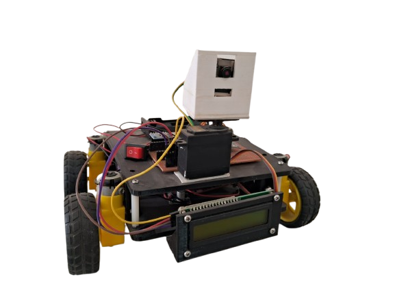

# 🤖 AIODR - Artificial Intelligence Object Detection Rover

[](https://www.espressif.com/en/products/socs/esp32)
[](https://www.python.org/)
[](https://docs.ultralytics.com/)
[](https://opensource.org/licenses/MIT)

**AIODR** is an advanced Bluetooth-controlled rover that integrates robotics with real-time AI object detection. By combining the **ESP32** ecosystem with **YOLOv8**, this project serves as a powerful bridge between IoT hardware and computer vision.

---

## 📸 Media & Demos

| **Physical Rover** | **AI Detection Feed** |
| :---: | :---: |
|  |  |
| *Assembled ESP32 Rover* | *Real-time YOLOv8 Object Classification* |

---

## **Features**  

- **📲 Bluetooth Control**  
  Operate the rover effortlessly through a custom mobile app, providing real-time directional control and feedback.

- **📸 Object Detection**  
  Harnesses the power of YOLOv8 to detect and classify objects with high accuracy and efficiency.

- **🌄 Camera Integration**  
  Equipped with the ESP32-CAM module to capture live video streams and provide continuous image processing.

- **🧠 AI-Powered Processing**  
  Leverages machine learning frameworks like TensorFlow and YOLOv8 for precise object identification and tracking.

- **💻 Python Backend**  
  Robust detection algorithms built using Python 3, utilizing OpenCV and NumPy for image preprocessing and analysis.

---  

## **Technologies Used**  

| Component          | Description                                                 |
|-------------------|-------------------------------------------------------------|
| **ESP32**          | Handles Bluetooth communication and controls motor movement |
| **ESP32-CAM**      | Captures and streams video for AI-based processing          |
| **Python 3**       | Core programming language for detection and control logic   |
| **OpenCV & NumPy** | Provides image processing and numerical analysis tools      |
| **TensorFlow**     | AI framework for object detection and classification        |
| **YOLOv8**         | Real-time object detection algorithm                        |

---  

## **How It Works**  

1. The ESP32 microcontroller establishes a Bluetooth connection with the mobile app.
2. Commands sent via the app control the movement of the rover (forward, backward, left, right).
3. The ESP32-CAM captures live video, streaming it to a Python processing unit.
4. Using OpenCV and NumPy, the video frames are processed and fed into the YOLOv8 model.
5. Detected objects are labeled and visualized in real-time on the mobile app or display.

---  

## **Applications**  

AIODR has a wide range of practical applications, including:

- 📚 **Educational Robotics & AI Learning**  
  Perfect for students and enthusiasts exploring robotics and artificial intelligence.

- 🛡️ **Surveillance & Monitoring Systems**  
  Can be deployed for home security and remote monitoring.

- 🚒 **Autonomous Navigation**  
  Potential to develop self-driving algorithms for exploration and obstacle avoidance.

- 🌱 **Agriculture & Environment Monitoring**  
  Useful for monitoring crops, livestock, and environmental conditions.

- 🏛️ **Industrial Applications**  
  Can assist in warehouse automation and quality inspection tasks.

---  

## **Getting Started**  

### **Hardware Requirements:**  

- ESP32 Development Board  
- ESP32-CAM Module  
- MG995 Servo Motor  
- 100 RPM DC Motors (x2)  
- L298N Motor Driver  
- Li-ion Battery Pack  
- 3D-printed chassis and laser-cut acrylic parts  

### **Software Requirements:**  

Make sure to install the following dependencies before running the project:

```bash
pip install opencv-python numpy tensorflow ultralytics
```

### **Installation Steps:**  

1. Clone this repository:
   ```bash
   git clone https://github.com/Orcos-nom/AIODR.git
   cd AIODR
   ```
2. Flash the ESP32 with the provided firmware using the Arduino IDE.
3. Run the Python detection script on your PC:
   ```bash
   python detection.py
   ```
4. Connect the mobile app via Bluetooth and control the rover.

---  

## **Future Improvements**  

We have several exciting plans to enhance AIODR, such as:

- 🧠 Implementing cloud connectivity for remote monitoring.
- 🌐 Enhancing object detection with custom-trained models.
- 🛠️ Adding autonomous path planning with obstacle avoidance.
- 🌟 Improving energy efficiency for prolonged operation.

---  

## **Contributing**  

We welcome contributions from the community! If you'd like to contribute to AIODR, feel free to submit pull requests or open issues to suggest enhancements and bug fixes.

---  

## **License**  

This project is licensed under the MIT License - see the [LICENSE](LICENSE) file for details.

---  

## **Acknowledgments**  

Special thanks to all contributors and the open-source community for their invaluable resources and support. Let's keep innovating! 🚀

---

**Follow the project and stay updated on future developments!**  

---

